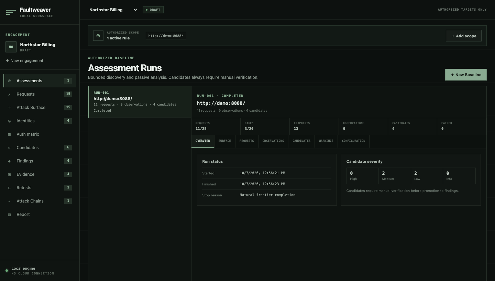
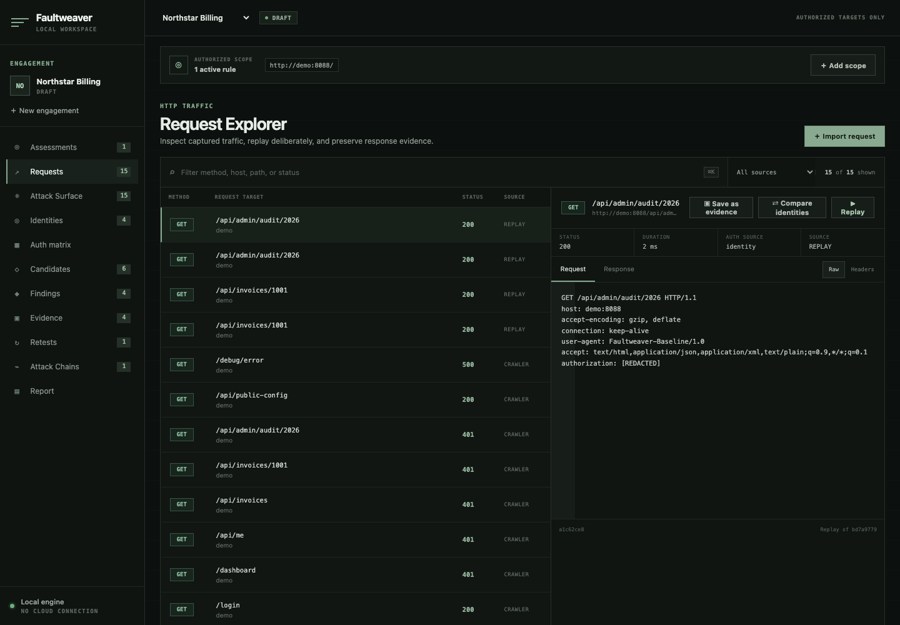
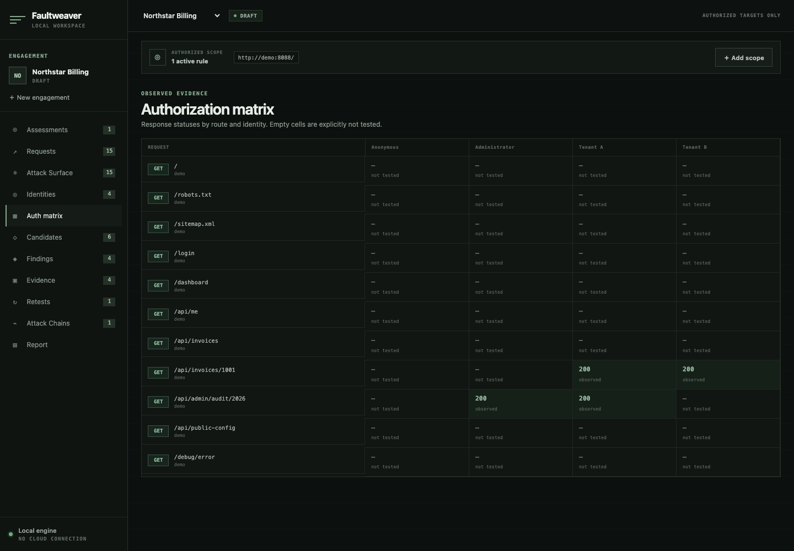
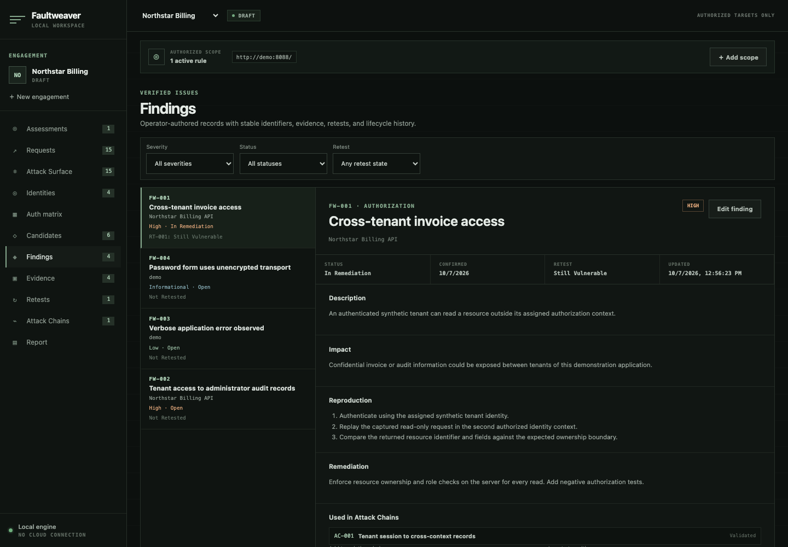
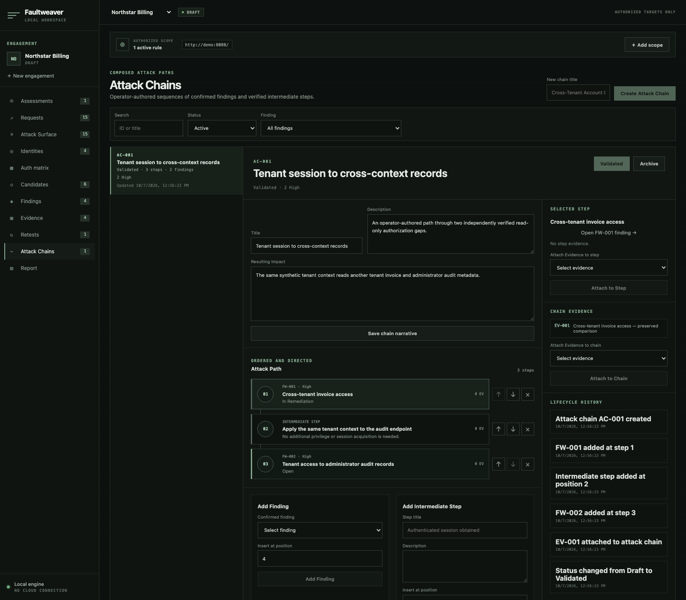
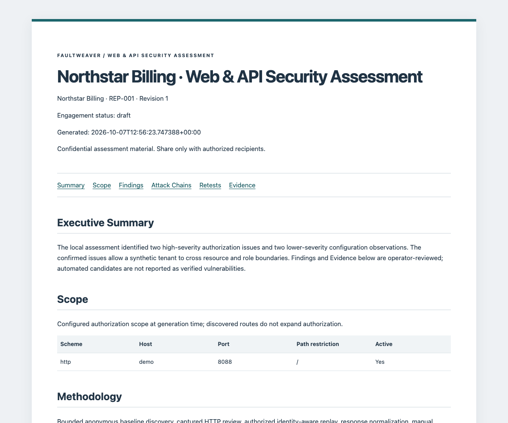

# Faultweaver

A local-first Web & API penetration-testing workspace for tracing authorized
traffic through manual verification, evidence, retesting, and reporting.

[Quick Start](#quick-start) · [Workflow](#core-workflow) ·
[Documentation](#documentation) · [Security](SECURITY.md)



*A local Northstar Billing assessment: explicit scope, bounded discovery, and
observations kept separate from confirmed Findings. All screenshots use synthetic data.*

## What is Faultweaver?

Faultweaver gives security testers one local workspace for captured HTTP traffic,
identity-aware comparisons, and the evidence behind an assessment. It connects
requests to Findings and their retests without treating an automated observation
as proof of a vulnerability.

You control scope, replay, confirmation, and the final report. Use it only on
systems you own, systems you are explicitly authorized to test, or local training
labs. It is a single-operator application, not a hosted service or an autonomous
exploitation tool.

## Core workflow

Scope → Traffic → Attack Surface → Replay / Identity Analysis → Candidate →
Finding → Evidence → Attack Chain → Retest → Report

Importing traffic does not send it. A Candidate needs manual verification before
promotion; Attack Chains and report conclusions are written by the operator.
See the [first assessment walkthrough](docs/getting-started.md#first-assessment).

## Features

- **Discovery** — bounded anonymous URL baselines; inert HAR, cURL, raw HTTP,
  and OpenAPI imports; distinct observed and declared Attack Surface entries.
- **HTTP Analysis** — searchable Request Explorer, deliberate scoped replay,
  normalized response comparison, and structured JSON diffs.
- **Identity & Authorization** — engagement-scoped authentication contexts,
  cross-identity comparisons, and a matrix that distinguishes observed results
  from untested combinations.
- **Findings & Evidence** — reviewed Candidates, operator-authored Findings,
  immutable redacted snapshots, stable identifiers, and lifecycle history.
- **Attack Chains** — ordered Finding and intermediate steps, linked Evidence,
  explicit validation, and non-destructive archival.
- **Retesting** — separate verification attempts with their own outcomes,
  operator notes, and Evidence; original records remain available.
- **Professional Reporting** — editable drafts and immutable revisions exported
  as offline HTML, Markdown, or schema-versioned JSON.
- **Local Security** — SQLCipher database storage, independently supplied keys,
  backend-enforced scope, bounded networking, and recognized-secret redaction.

## Screenshots

<details>
<summary>Explore four workspace views</summary>

### Request Explorer



Inspect captured traffic alongside request details, then choose whether to replay,
compare identities, or preserve Evidence.

### Authorization matrix



Review recorded responses by route and identity. An empty cell means **not tested**,
not allowed or denied.

### Findings



Keep impact, reproduction, remediation, and retest outcomes with the confirmed issue.

### Attack Chains



Explain how confirmed issues relate through an ordered path. Faultweaver does not
infer chains or execute their steps.

</details>

## Quick Start

For a fresh local installation on macOS or Linux, install Docker with Compose,
Python 3.13, `uv`, and `make`. Run these commands from the repository root. Node.js is
not required on the host for Docker startup.

```bash
uv sync --locked --project backend --all-groups
export FAULTWEAVER_KEY_PROVIDER=file
export FAULTWEAVER_MASTER_KEY_FILE="${FAULTWEAVER_MASTER_KEY_FILE:-$HOME/.local/share/faultweaver-keys/master.json}"
uv run --project backend faultweaver-storage init-key && make up
```

Open **http://localhost:5173**. Create an Engagement, add exact authorized scope,
then import traffic or start a bounded baseline. The web workspace and API bind
only to loopback; the encrypted database is retained in a Docker volume.

The key must stay outside every Git repository and data volume. Back it up
separately: **key loss is unrecoverable**. `init-key` is a one-time operation and
never replaces an existing key. On later starts, restore the same environment
variables and run `make up`. `make down` stops services without deleting data.
Existing plaintext databases require the explicit
[migration procedure](docs/secret-storage.md#legacy-migration).

For an optional practice target, run `make demo-up`. **Northstar Billing is
intentionally vulnerable** and disabled by default. Use `http://demo:8088/` as
scope when the API runs in Docker; its browser view is at
http://127.0.0.1:8088. Keep it local. See the
[demo guide](docs/demo-saas.md) for public synthetic identities and the workflow.

## Tested compatibility

Validated locally against these independent training applications **for the
documented workflows**, not every challenge, lesson, vulnerability, or version:

- [OWASP Juice Shop 20.2.0](docs/compatibility/juice-shop.md)
- [DVWA 2.5](docs/compatibility/dvwa.md)
- [OWASP WebGoat 2026.4](docs/compatibility/webgoat.md)
- [OWASP Mutillidae II 2.12.8](docs/compatibility/mutillidae.md)

Each matrix records validated, partial, and unexercised capabilities. The labs
are opt-in, loopback-only, and separate from normal startup and CI.

## Security model

Faultweaver trusts one local operator. It has **no workspace login or multi-user
isolation** and is not supported on a shared network or the public internet.

The backend checks exact URL scope before outbound requests and each redirect.
The crawler uses bounded anonymous GET requests; it does not submit forms or
execute JavaScript. Imports are parsed as data, and Findings require manual
confirmation.

Sensitive database state is encrypted using SQLCipher, with key material supplied
separately. This protects a copied database without its key, not a compromised
running backend or host. Redaction recognizes common credentials; arbitrary
application data and operator prose may still be confidential. Downloaded reports
leave encrypted storage and must be reviewed before sharing.

Read [SECURITY](SECURITY.md) and [storage, key backup, and recovery](docs/secret-storage.md)
for the full boundaries.

## Reporting

Write the executive summary, scope, methodology, limitations, and conclusion;
select Findings, Evidence, Attack Chains, and Retests; then preserve a revision.
Later edits do not change that revision's captured content.

- **HTML** — standalone, offline report with print styles and no external assets.
- **Markdown** — portable text for review and downstream editing.
- **JSON** — schema-versioned canonical assessment data.



*A preserved report revision, readable without the running workspace.*

See the [reporting guide](docs/reporting.md) for draft, revision, and export behavior.

## Documentation

- [Getting started](docs/getting-started.md) — first assessment and native development.
- [Baseline assessments](docs/baseline-assessments.md) — crawler bounds and passive checks.
- [Architecture](docs/architecture.md) — data model, imports, and service boundaries.
- [Reporting](docs/reporting.md) — report composition and immutable revisions.
- [Secret storage](docs/secret-storage.md) — providers, backups, loss, and migration.
- [Northstar Billing](docs/demo-saas.md) — intentionally vulnerable local demo.
- [Security policy](SECURITY.md) · [Changelog](CHANGELOG.md) · [MIT license](LICENSE)

## Limitations

- One trusted local operator; no built-in authentication or public deployment support.
- URL scope is not DNS pinning or an egress firewall.
- No promise of complete vulnerability coverage. Discovery does not execute
  JavaScript, authenticate, or submit forms; cURL import supports a bounded subset.
- Exports are confidential plaintext. Redaction is not a general PII classifier.
- No key rotation or recovery after key loss; encryption does not protect an unlocked host.
- Chromium is the validated browser. Other browsers have not been certified.
- Validation is bounded, not enterprise-scale or independent security certification.
- No native PDF exporter; HTML provides print styles for external printing.

## Development / validation

FastAPI, SQLAlchemy, and SQLCipher form the backend; SvelteKit and TypeScript
form the frontend. Tested runtimes: Python 3.13 (3.13.5 locally, 3.13.11 in
Docker), Node.js 22.23.3, and `uv` 0.11.8. Use Node 22.x, at least 22.17;
newer major versions are outside the validated baseline.

```bash
make install
make validate
```

Locked installs, Ruff checks, backend/demo tests, Svelte/TypeScript checks,
frontend tests, and the production frontend build run without lab traffic.
External compatibility runners are separate, explicit `make compatibility-*`
commands documented in their matrices. See
[native development](docs/getting-started.md#native-development) for API/web startup.
